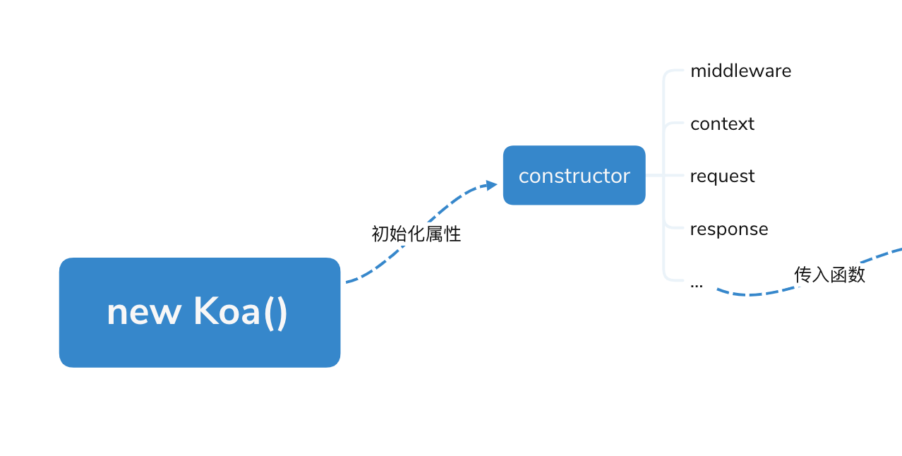
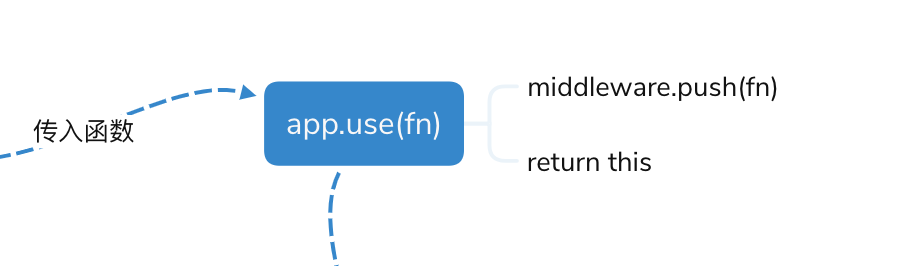
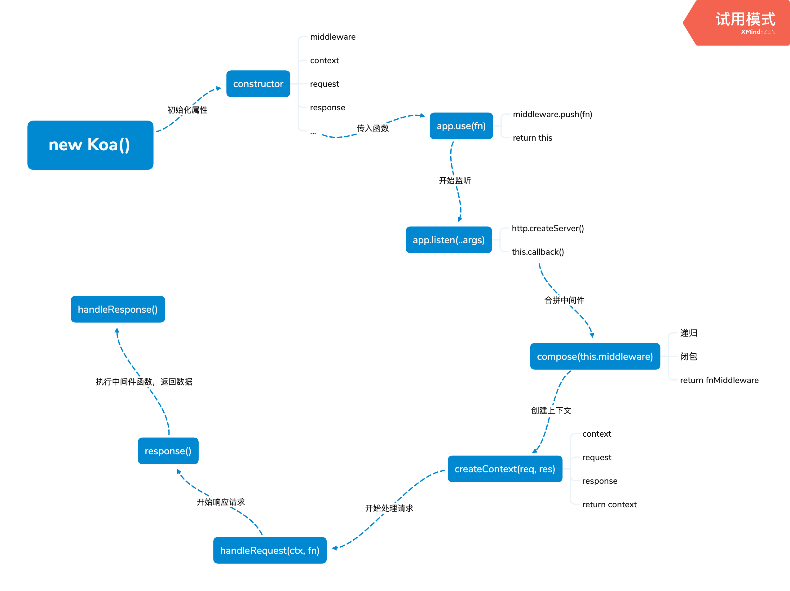

# koa-analysis
Koa.js 源码分析

### 目录结构
```text
.
├── LICENSE
├── README.md
├── app.js              实例代码
├── application.js      入口文件
├── compose.js          合并中间件
├── context.js          上下文对象
├── request.js          请求对象
└── response.js         响应对象
```

### 一切从这三段代码说起
```JavaScript
const Koa = require('koa')
const app = new Koa()

app.use(async (ctx, next) => {
  ctx.body = 'Hello, Koa'
})

app.listen(3000)
```

大家都知道，Koa 是 Node.js 的一个框架，Koa 主要对 Node.js 的 HTTP 模块进行再次的抽象封装，并基于 Promise 提供控制流程，它本身并不包含任何的附加功能，但是允许用户可以自由组合中间件，从而让 web 应用开发变得更加可控和富有表现力。

Koa 不仅代码精简，且使用起来也很简单，只需要 引入 `koa` 模块使用 new 操作符就可以实例化一个 Koa 对象了， 那么思考一下使用 `new Koa()` 到达做了些什么事情呢？为什么使用了 `use()` 方法传入一个函数就叫中间件函数呢？为什么使用 `listen()` 方法监听一个端口就可以开启一个 HTTP 服务了呢？带着这些的问题，先简单的聊一聊 Koa 的生命周期。

首先在入口文件的 `application.js` 文件里是暴露导出了一个类，这个类就是相当于 Koa 类，使用 `new Koa()` 时就得到了一个 koa 实例化对象，Koa 类的构造函数 ( constructor ) 会进行一系列的初始化工作，其中比较重要的有 中间件 middleware 数组，context、request、response对象，和use、listen等方法，这就完成了 `new Koa()`的工作。


然后得到了 Koa的实例对象，我们命名为 app，这个 app 实例对象会拥有 Koa 类的所有方法，其中有个方法叫 `use()`，这个 `use(fn)` 方法接收一个 fn 函数的参数，这个方法主要做的工作就是把传入的函数新增到（ push ）到中间件数组 ( middleware ) 中，然后 return this，可以保持链式调用。



还一个 `listen()` 的方法，这个方法主要的工作做了2个：第一、使用了 Node.js 原生的 HTTP 模块创建了一个服务器，第二、在创建服务器函数里，传入一个 `this.callback()` 方法，这个 `this.callback()` 方法做了大量的工作，比如处理中间件，创建上下文，处理请求对象，响应请求，返回数据等工作。下面来详细聊聊 callback 方法做了具体的内容。

`this.callback()` 方法第一步是使用 `koa-compose` 中间件的 compose  函数进行把多个中间件函数合并成为一个大的中间件函数，然后进行创建一个上下文对象，开始处理请求、执行中间件函数、最后响应请求返回数据，整个生命周期的流程就结束了。下面的简单描述了Koa生命周期的流程图：



